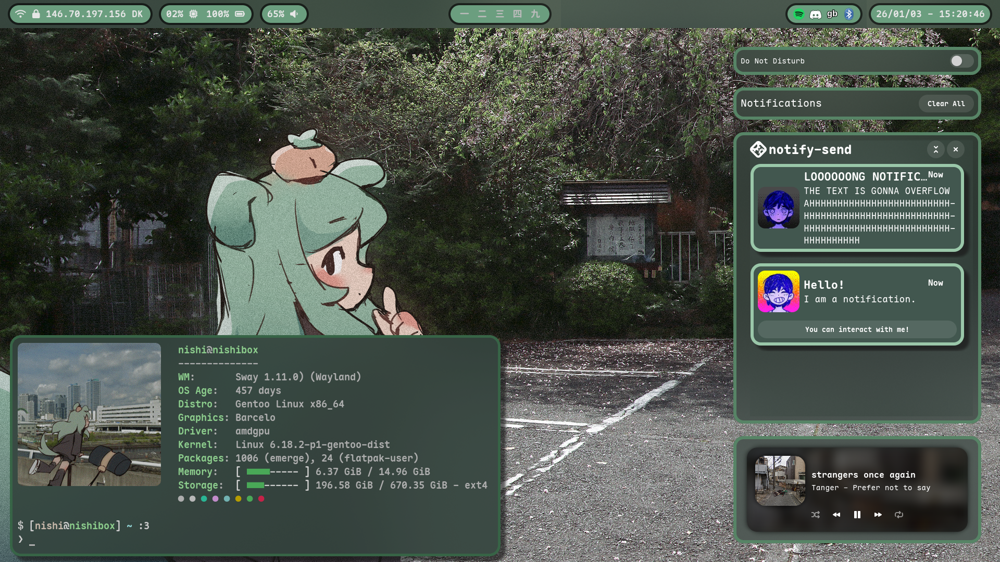
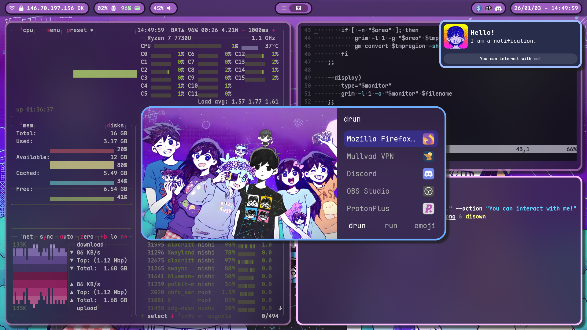
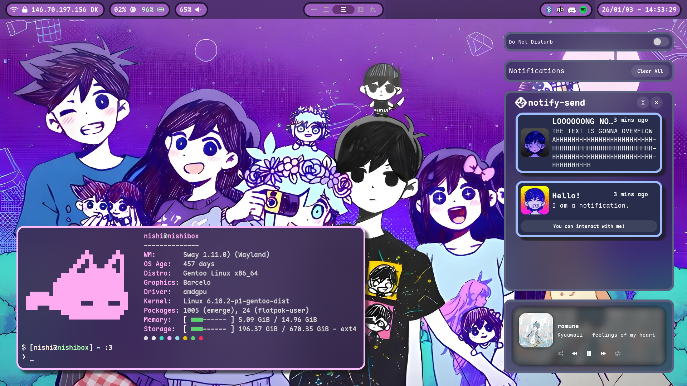
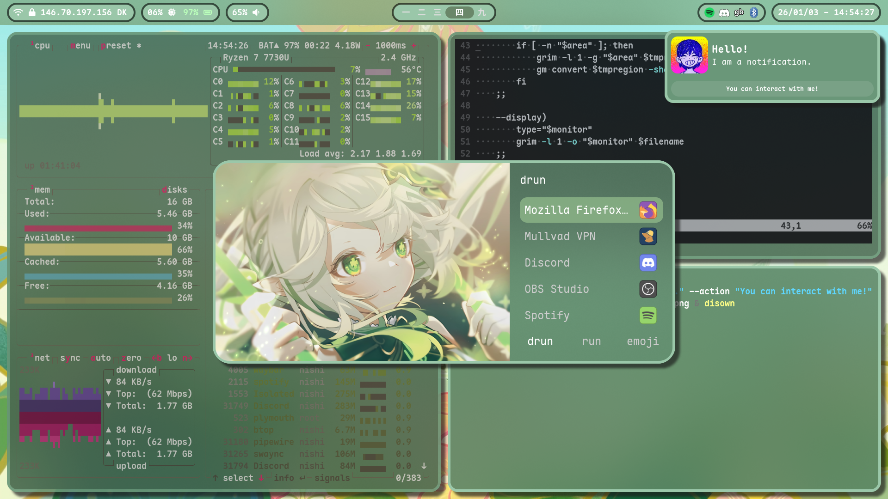
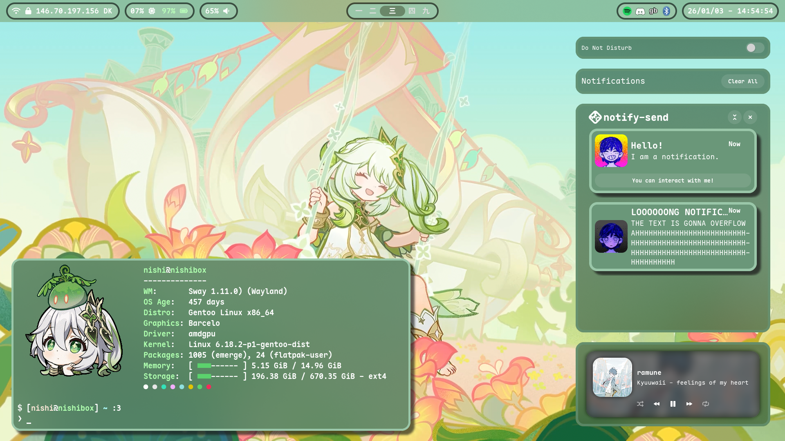

# swayfx-dots
there is a good chance i probably missed something in my configs\
yell at me in issues if something no worky

## some info
gentoo linux\
openrc

theres a theme switcher in ~/.config/sway/extra/scripts/themeswap.sh\
ill make a rofi menu instead when i eventually get too annoyed\
at manually invoking the script

## things you need (maybe):
swayfx (duh)\
awww (formerly swww)\
mpvpaper\
swaync\
alacritty [(fork)](https://github.com/ayosec/alacritty/tree/graphics)\
rofi (+ rofi emoji)\
hyprlock\
waybar\
[autotiling](https://github.com/nwg-piotr/autotiling)

# stuff needed for small scripts

## screenshot
jq\
grim\
sway\
slurp\
graphicsmagick\
wl-clipboard\
hyprpicker (freeze screen)

## waybar vpn module
jq\
curl\
mullvad

  
Tanger theme

  <table>
    <tr>
      <td></td>
      <td></td>
    </tr>
  </table>

  
Omori theme

  <table>
    <tr>
      <td></td>
      <td></td>
    </tr>
  </table>

  
Nahida theme

  <table>
    <tr>
      <td></td>
      <td></td>
    </tr>
  </table>

